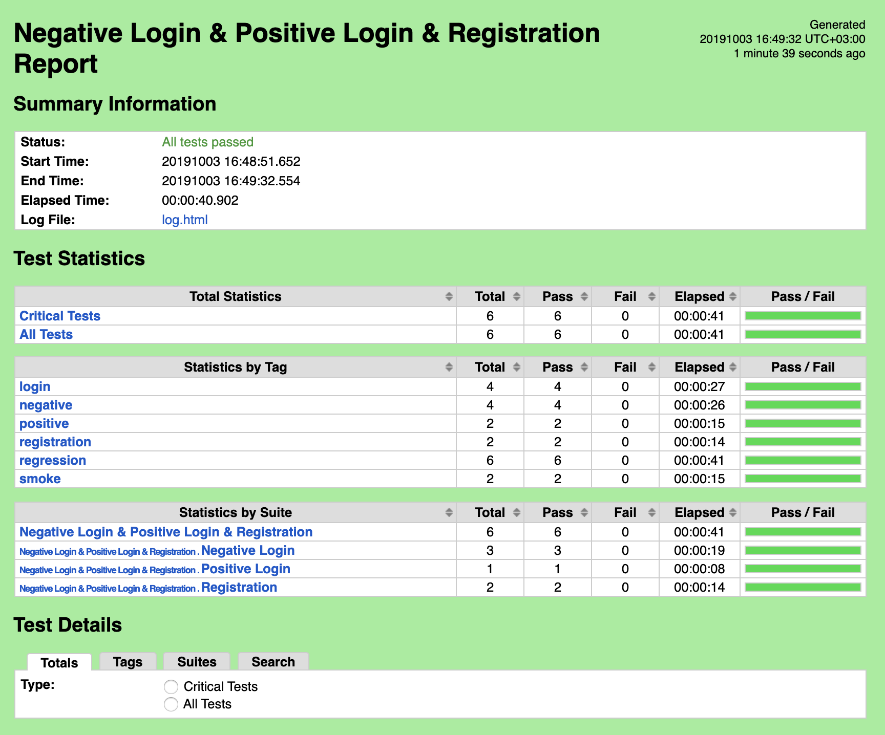
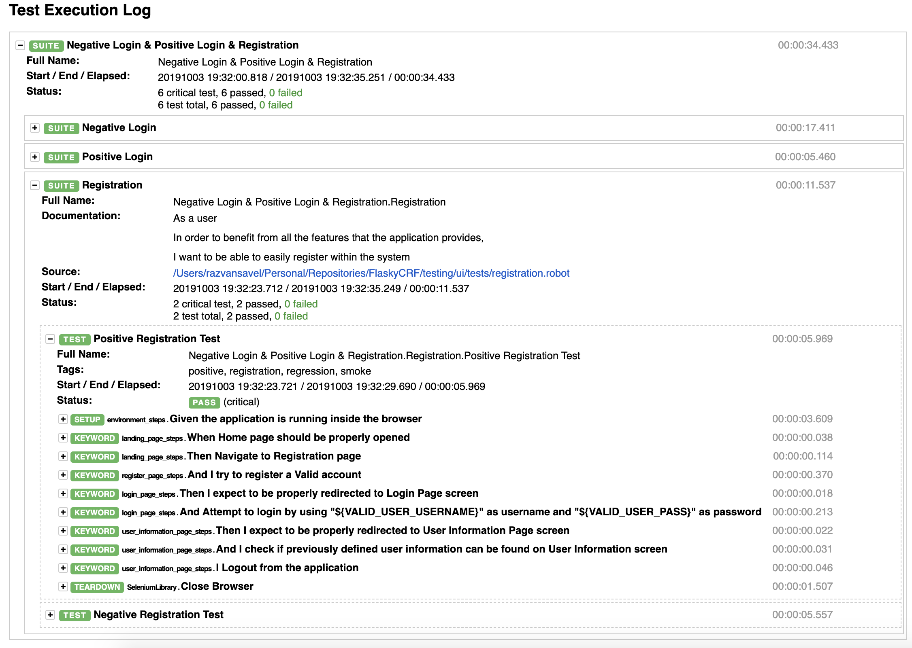
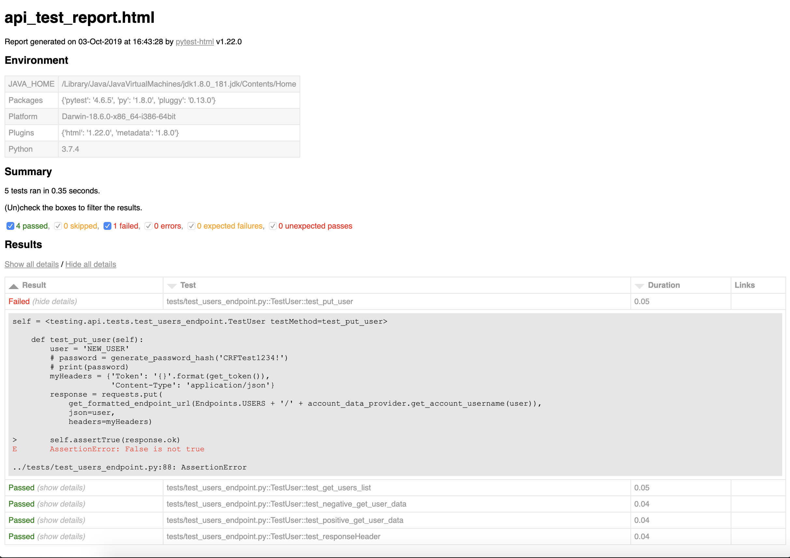

# CRF Assignment Implementation #

## Run Docker Image ##

* In order to launch the docker container for the AUT, navigate to the project root and execute `docker run -p 5000:5000 <docker_image>`

## Project Structure ##

* All the tests created are stored inside `testing` directory 
* `ui` and `api` directories representing the testing types
* The application cam be accessed at `http://0.0.0.0:5000/` address (8080 port was already in used by some other locally configured services)
```
 testing/
    api/
        config/
            endpoints.py
            environment_constants.py
        support/
            account_data_provider.py
        tests_data/
            account_data.json
        test_results/
        test_runners/
            run_api.tests.sh
        tests/
            test_users_endpoint.py
    ui/  
        config/  
            config.robot  
        features/
            registration.robot
            positive_login.robot
            negative_login.robot
        test_suites/
            run_ui_negative_tests.sh
            run_ui_smoke_tests.sh
            run_ui_positive_tests.sh
            run_ui_regression_tests.sh
        steps/
            environment_steps.robot
            landing_page_steps.robot
            register_page_steps.robot
            login_page_steps.robot
            home_page_steps.robot
        test_data/
            accounts.robot
        test_results/
            smoke/
            positive/
            negative/
            regression/
        pages/
            landing_page.robot
            login_page.robot
            register_page.robot
    README.md
```

## Test Execution ##

#### UI Tests ####
* In order to execute the UI related tests (as a test suite), you need to navigate from the `terminal` to `testing/ui/test_suites`
* To execute any of the desired shell file that is pointing to an associated test suite type, run `sh <your_desired_suite>` command

* Associated test results are displayed into the corresponding `testing/ui/test_results/<your_executed_suite>` directory
* Generated `.html` test results file being something similar to following one:
 **Figure 1** - UI Test Results
 **Figure 2** - UI Test Results Detailed
 
#### API Tests ####

* API related tests can be easily found by navigating from the `terminal` to `testing/api/tests_runners/` 
* Execute `sh run_api_tests.sh` command
* After all existing tests have been executed, the test results html report can be found within `testing/api/test_results` directory
* Generated `.html` test results file being something similar to following one:
 **Figure 3** - API Test Results


## Remarks ##

* Initially, I had some problems in making the docker container be accessed from the outside
    * Apparently, on MAC OS, in order to access any resource of a container, wou need to explicitly add the `-h 0.0.0.0` argument when performing `flask run` command
    
#
* The user is able to register other users while he is already authenticated (by accessing /register link)
    * So basically, the user is able to get anywhere from any place, as long as he has the URL to that page
* No proper validation is put in place when it comes to registration
* The `users /PUT` api endpoint allow for user creation, even though nom `username` or `password` is provided as payload
* The user is able to register himself by adding only spaces as characters for all available attributes
* In order to have at least one user inside of the DB before starting to execute the tests, I have altered the `schema.sql` file,
 so that each time the application is run, 2 users will be created by default
* It is quite useless to assign IDs to all available User Information attribute values. I understand that the application needs to be testable, but not necessarily in such manner
* I would have expected to get an array of users objects whenever I perform a get request over '/users' endpoint, and not only an array of usernames
